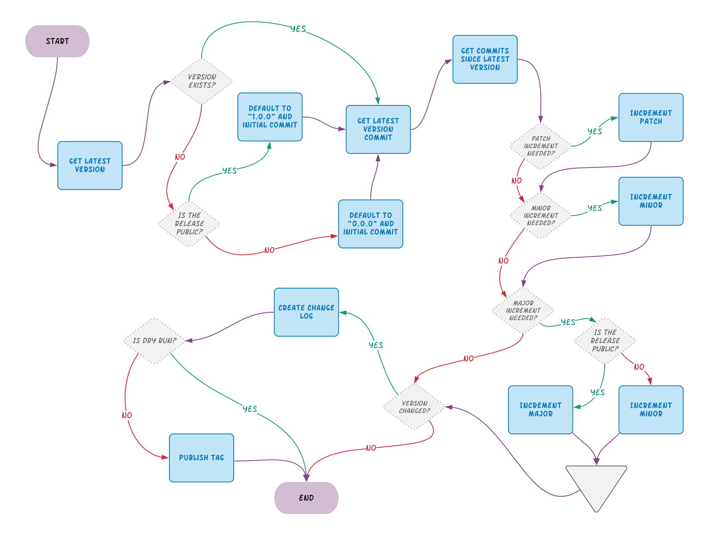

# ||l @priestine/versions


[](https://codeclimate.com/github/priestine/versions/maintainability)
[](https://codecov.io/gh/priestine/versions)

[](https://github.com/xojs/xo)
[](https://github.com/prettier/prettier)
[](https://github.com/priestine/versions)

A tool for automating [Semantic Versioning](https://semver.org) on your project.

## Features

- ✅ Compatible with GitHub releases. _GitLab releases and direct git tagging (hello, BitBucket) on the way!_
- ⚙️ Bump versions for the code written in any programming language with no configuration - only git matters
- 📝 Automatically generated list of changes that is put into the release body. _An option to also write to a file will also be available!_
- 🤔 Works with [gitmoji](https://gitmoji.carloscuesta.me) commits convention. _[conventional commits](https://www.conventionalcommits.org/en/v1.0.0/) and [turbo-git](https://github.com/labs-js/turbo-git) comming soon, as well as custom conventions you can set up for your project_

## 📝 Docs

- [Publishing released version to NPM](./docs/js-ts/npm.en.md)

## Why

I'll tell you why a little bit later, when I have some free time.

## Getting Started

Using @priestine/versions is quite simple. You need Node installed and with that in place, you just `npx @priestine/versions`. Take a look at the examples provided below.

### Local Machine Example

Go to the folder where your project lives and:

```shell
npx @priestine/versions --token=$TOKEN --repository=$OWNER/$REPO
```

### GitHub Actions Example

```yml
# The name may be anything you like
name: Priestine Versioning
on:
 push:
  # The workflow will run when a push lands on the master branch
  branches: [master]
jobs:
 # This name may also be arbitrary
 versioning:
  # I didn't test it on Windows but it should be ok
  runs-on: ubuntu-latest
  steps:
   # Use checkout action to get the code
   - uses: actions/checkout@v2
     with:
      # Full depth is important because by default checkout action only fetches one commit
      fetch-depth: 0
   # Install Node to make @priestine/versions work
   - name: Setup Node
     uses: actions/setup-node@v1
     with:
      node-version: '12.x'
   # Do stuff
   - name: Publish new version if applicable
     run: npx @priestine/versions --token=${{ secrets.PRIESTINE_VERSIONS_TOKEN }} --repository=$GITHUB_REPOSITORY
```

## Configuration

The provided configuration means have the following precedence:

1. Configuration files are checked first and provided values replace defaults
2. Environment variables are checked second and provided values replace defaults and configuration file values
3. CLI options are checked last and provided values replace defaults, configuration file values and enviroment variable values

All options that accept `true` or `false` as a value are **false** by default.

| Option                            | CLI Usage Example                          | Environment Usage Example                                   | Default   |
| --------------------------------- | ------------------------------------------ | ----------------------------------------------------------- | --------- |
| [Config File](#config-file)       | **--config-file=PATH**                     | **PRIESTINE_VERSIONS_CONFIG_FILE**=PATH                     | `""`      |
| [Token](#token)                   | **--token=\$SOME_TOKEN**                   | **PRIESTINE_VERSIONS_TOKEN**=\$SOME_TOKEN                   | `""`      |
| [Repository](#repository)         | **--repository=octocat/github**            | **PRIESTINE_VERSIONS_REPOSITORY**=octocat/github            | `""`      |
| [Latest Version](#latest-version) | **--latest-version=0.0.0**                 | **PRIESTINE_VERSIONS_LATEST_VERSION**=0.0.0                 | `""`      |
| [Prefix](#prefix)                 | **--prefix=v**                             | **PRIESTINE_VERSIONS_PREFIX**=v                             | `""`      |
| [Merges](#merges)                 | **--merges=\<include \| exclude \| only>** | **PRIESTINE_VERSIONS_MERGES**=\<include \| exclude \| only> | `exclude` |
| [Bump Patch](#bump-patch)         | **--bump-patch**[=\<true \| false>]        | **PRIESTINE_VERSIONS_BUMP_PATCH**=\<true \| false>          | `false`   |
| [Bump Minor](#bump-minor)         | **--bump-minor**[=\<true \| false>]        | **PRIESTINE_VERSIONS_BUMP_MINOR**=\<true \| false>          | `false`   |
| [Bump Major](#bump-major)         | **--bump-patch**[=\<true \| false>]        | **PRIESTINE_VERSIONS_BUMP_MAJOR**=\<true \| false>          | `false`   |
| [Public](#public)                 | **--public**[=\<true \| false>]            | **PRIESTINE_VERSIONS_PUBLIC**=\<true \| false>              | `false`   |
| [Dry Run](#dry-run)               | **--dry-run**[=\<true \| false>]           | **PRIESTINE_VERSIONS_DRY_RUN**=\<true \| false>             | `false`   |

> With CLI options that accept **boolean** values, providing those values is **_optional_**. `--bump-patch` and `--bump-patch=true` are completely the same.
>
> With environment variables that accept **boolean** values, providing those values is **_required_**.

### Detailed description

#### Config File

You can provide a custom config file that contains application setup. Supported file formats are **JSON**, **YAML** and **TOML**. The files are allowed to provide any of the configuration for the app, including additional options that cannot be provided by other means.

#### Token

Token is used to publish the tag with associated release using GitHub API. For some reason, the `$GITHUB_TOKEN` that is automatically provided by GitHub Actions didn't work for me. So, for now, a custom token is needed. To make it work, you can just issue a token yourself. The token needs **read/write** access to the repository.

#### Repository

You MUST provide `--repository=$REPOSITORY` option that is usually available in CI tools already, e.g. `$GITHUB_REPOSITORY` in GitHub Actions. Internally, it is a part of the repository URL containing the owner and the repo name, e.g. **priestine/versions** for the @priestine/versions repository. Even if your CI tool doesn't provide it, it's not too complicated so you can put it yourself.

#### Latest Version

You can customize the tag from which @priestine/versions should start checking commits. **NOTE** - in this case, the version that will be produced by @priestine/versions may already be in place. Use carefully.

#### Prefix

Allows prefixing versions with things like **v** (e.g., `v1.0.0`). This is a common pattern as it enables easier glob matching for tags, but keep in mind that using a prefix makes the version non-compliant with Semantic Versioning.

#### Merges

This option configures the usage of **merge** commits. If you want to use merge commits as the main source information about codebase changes, you may set up this option to `only` to avoid evaluating other commits. By default, merge commits are _excluded_.

#### Bump Patch

If, for some reason, you want to force bumping the patch version, even if it is not needed based on the types of commits you've made since the previous release, you can provide the `--bump-patch`. Keep in mind that this may negatively affect the appearance of your changelog.

#### Bump Minor

If, for some reason, you want to force bumping the minor version, even if it is not needed based on the types of commits you've made since the previous release, you can provide the `--bump-minor`. Keep in mind that this may negatively affect the appearance of your changelog.

#### Bump Major

If, for some reason, you want to force bumping the major version, even if it is not needed based on the types of commits you've made since the previous release, you can provide the `--bump-major`. Keep in mind that this may negatively affect the appearance of your changelog.

#### Public

According to the Semantic Versioning specification, releases that have a MAJOR version of **0** are not considered stable. Breaking changes for these releases bump MINOR version instead of the MAJOR one. These rules also apply if you use @priestine/versions - by default, your versions will have MAJOR version of **0**. The changelog is created with MAJOR changes separate from MINOR ones, though. You can provide this option to exit the experimental stage. The closest release will be `1.0.0`, thus declaring public API.

Applying this option is irreversible. This option is only applicable if you don't have releases with MAJOR version higher than **0**. Otherwise, your project is considered to have public API declared already and you cannot publish `0.x.x` versions anymore.

#### Dry Run

Execute the command but skip publishing the release. May be useful for debugging or just to check what version your application is going to have next.

### Config Files

#### JSON Config File

You can provide a `.json` file with a path relative to the current working directory and it will be parsed as a JSON file.

```json
{
	"token": "",
	"repository": "",
	"latestVersion": "",
	"prefix": "",
	"merges": "exclude",
	"bumpPatch": false,
	"bumpMinor": false,
	"bumpMajor": false,
	"public": false,
	"dryRun": false
}
```

#### YAML Config File

You can provide a `.yml` or `.yaml` file with a path relative to the current working directory and it will be parsed as a YAML file.

```yaml
token: ''
repository: ''
latestVersion: ''
prefix: ''
merges: 'exclude'
bumpPatch: false
bumpMinor: false
bumpMajor: false
public: false
dryRun: false
```

#### TOML Config File

You can provide a `.toml` file with a path relative to the current working directory and it will be parsed as a TOML file.

```toml
token = ""
repository = ""
latestVersion = ""
prefix = ""
merges = "exclude"
bumpPatch = false
bumpMinor = false
bumpMajor = false
public = false
dryRun = false
```

## How it works

This intentionally over-complicated diagram depicts the application execution process:



## Caveats

- **Help needed** - for some reason, `$GITHUB_TOKEN` did not work for me when I tried to use it for creating releases from GitHub Actions. I am not very skilled with this tool so there's probably me doing something wrong.
- Currently, @priestine/versions only works with GitHub (on-premise solutions not supported yet) and gitmoji as a commit convention.
- There might be a problem with using @priestine/versions with git repositories that have multiple unrelated histories merged. Specifically, when there are no previous Semantic Version tags and the tool tries to check commits since the initial commit. The problem is that in this case there will be multiple initial commits. Current workaround is to manually tag the commit that is desired to be used as the initial one, with a tag like '0.0.0' and then execute @priestine/semantics with `--latest-version=0.0.0`.
